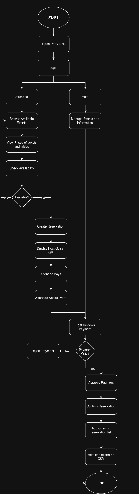
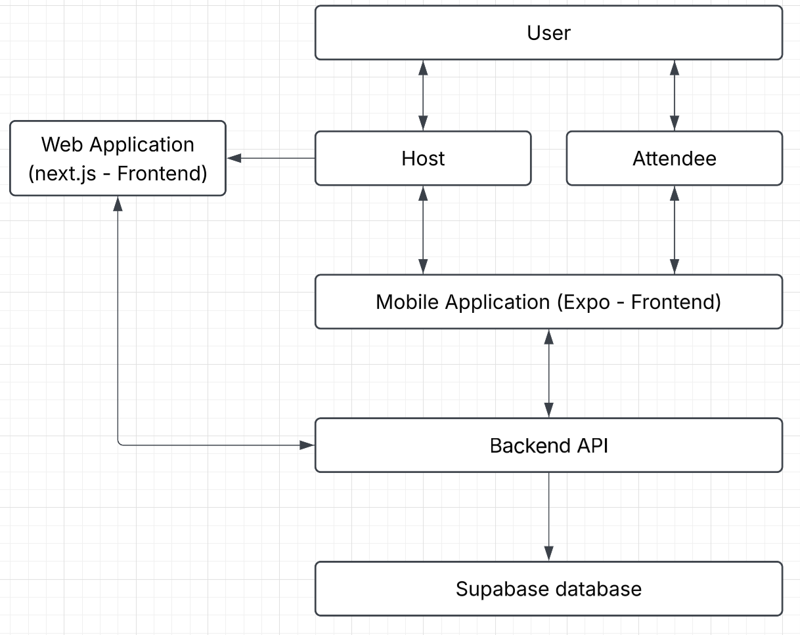
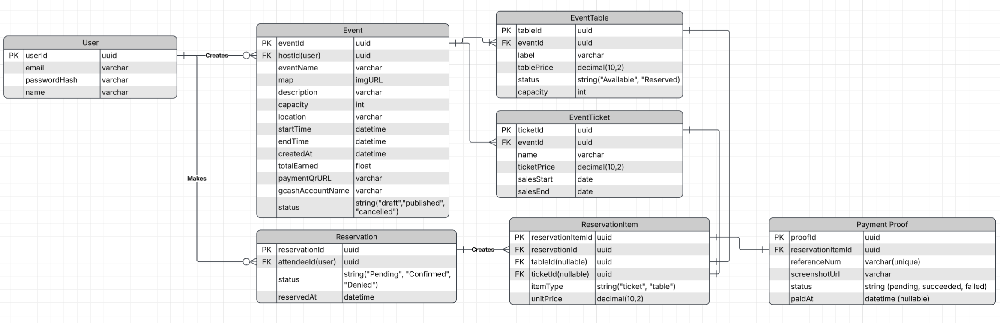

**Party Link (party-rentals)**  
Please refer to our jira for more detailed documentation.

**Overview**

- **Problem:** Party hosts often manage registrations through Instagram and other social media pages, making important information such as pricing, event details, location, availability, and registration difficult to find and inconsistent across hosts.

- **Solution:** Create a simple, centralized flow where attendees can easily discover party hosts, view event details and pricing, check availability, register, and submit payment for review.

- **Goal:** Make party registration faster, clearer, and more organized for attendees while giving hosts a centralized system to manage reservations, payments, and event information.

- **Scope:** The system consists of a mobile application for attendees and hosts and a web dashboard for verified hosts. The mobile app focuses on event discovery, booking, reservations, payments, digital tickets, and event management, while the web dashboard provides verified hosts with tools to monitor ticket sales, earnings, hosted events, and followers.  
  The system is focused specifically on event booking and management and does not include third-party services such as catering, transportation, equipment rentals, venue rentals, or security management. Payments are processed externally and are not held by the application.

**Roles**

- Project Manager: Marie Jirsten Chan
- Fullstack: Tyrone Niere
- UI/UX frontend: Christine Arenal

**System Details**

- Users: Hosts and Attendees
- Core features:
  - **Easy Booking System:** Allows attendees to browse events, view pricing and details, check availability, and make reservations through a simple booking flow.
  - **Payment Verification:** Attendees can submit their GCash payment reference and receipt for the host to review and approve.
  - **Guest Management:** Hosts can view and manage their registered attendees and reservations.
  - **CSV Export:** Hosts can export guest and reservation information into a CSV file for easy guest-list management, review, and record keeping.
  - **Event Management:** Hosts can provide and manage their event information, including pricing, location, schedules, and availability.

Functional Requirements:

- Users
  - Create and manage events
  - Set pricing and availability
  - View reservations
  - Review payment submissions
  - Approve/reject payments
  - Export guest information as CSV
  - View available events
  - View event details and pricing
  - Check availability
  - Create a reservation
  - Submit GCash payment proof
  - View reservation/payment status

Differentiation of Features

| Feature           | Host Feature | Attendee Feature |
| :---------------- | :----------- | :--------------- |
| Browse Events     | Yes          | Yes              |
| Make Reservations | No           | Yes              |
| Submit Payment    | No           | Yes              |
| View Reservations | Yes          | No               |
| Create Events     | Yes          | No               |
| Export Guest List | Yes          | No               |

**Business Process Flow Chart**

**Entity Relationship Diagram**

**System Architecture**  

